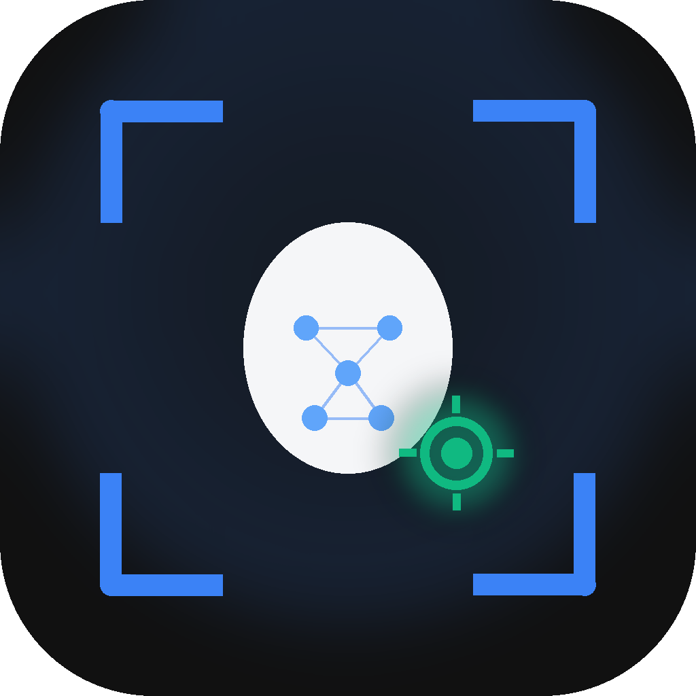

<div align="center">

  

  # Face Seeker
  **100% Offline Target Face Detector for Law Enforcement & Forensic Surveillance Analysis**

  <p align="center">
    <a href="https://dotnet.microsoft.com/"></a>
    <a href="https://python.org"></a>
    <a href="https://opencv.org"></a>
    <a href="#-privacy--security"></a>
    <a href="https://github.com/amshivang/FaceSeeker/releases/latest"></a>
    <a href="LICENSE"></a>
  </p>

</div>

---

## 🚀 What's New in Version 2.0.0

- **Decoupled C# + Python Architecture**: Replaced web-container UI with a native .NET 8 WPF application connected to a high-speed Python computer vision daemon via local TCP socket IPC.
- **Studio-Grade Dark Interface**: Completely redesigned user experience inspired by Linear, Raycast, and VS Code. High spatial density, refined typography, and zero visual clutter.
- **Dual-Resolution Inference (4x–8x Faster)**: Video frames are intelligently downscaled to 640px for YuNet face detection while bounding boxes and facial landmarks are mathematically re-projected back to full resolution, achieving blistering scan rates even on 1080p and 4K footage.
- **1:N Winner-Takes-All Identification**: Multi-target matching computes cosine similarities across all enrolled subjects and attributes detected faces strictly to the single highest-scoring match above the threshold, eliminating false cross-match duplicates.
- **High-Frequency UI Match Buffer**: Asynchronous match events are batched into a thread-safe background queue drained at 60 FPS, ensuring buttery-smooth scrolling and zero UI freeze during rapid detection bursts.
- **Instant Scan Cancellation**: Cancel commands are processed instantly by the engine without locking video file handles or blocking the socket event loop.
- **Evidentiary Export**: One-click export to CSV (with culture-invariant decimal formatting for international compatibility), structured JSON, and grouped TXT investigative summary reports.
- **Target Photo Pre-scaling**: Enrolled suspect photos are automatically scaled to 1000px JPEG in memory, reducing IPC payload overhead by 98% and eliminating socket transmission delays.
- **Comprehensive Automated Test Coverage**: Built-in test suites comprising **24 C# unit tests** (`MSTest`) and **11 Python engine tests** (`unittest`).

---

## 🛠️ Architecture & Technology Stack

```
┌─────────────────────────────────────────────────────────────┐
│                   Face Seeker Desktop (v2.0.0)              │
├──────────────────────────────┬──────────────────────────────┤
│      C# .NET 8 WPF GUI       │     Python Vision Engine     │
│  (Modern MVVM Architecture)  │      (OpenCV DNN Core)       │
├──────────────────────────────┼──────────────────────────────┤
│ • MainViewModel Cockpit      │ • FaceSearchPipeline (1:N)   │
│ • High-Frequency Batch Queue │ • YuNet Face Detector        │
│ • Precision Dark Theme       │ • SFace Feature Recognizer   │
│ • Export & Settings Manager  │ • VideoScanner Frame Loop    │
└──────────────┬───────────────┴──────────────▲───────────────┘
               │    Localhost TCP Socket IPC   │
               └───────────────►───────────────┘
                     JSON Protocol (Port 54321)
```

| Layer | Technology | Role |
|---|---|---|
| **User Interface** | C# .NET 8, WPF, CommunityToolkit.Mvvm | Native desktop window, drag-and-drop ingestion, match visualization, settings |
| **Inter-Process Comm** | System.Net.Sockets, System.Text.Json | Asynchronous UTF-8 JSON streaming over localhost TCP |
| **Face Detection AI** | YuNet ONNX (`libopencv_dnn`) | Fast deep-learning face detector with 5-point facial landmark regression |
| **Face Recognition AI**| SFace ONNX (`libopencv_dnn`) | 128-dimensional embedding extractor with Cosine Similarity matching |
| **Video Decoding** | OpenCV `VideoCapture` | Multi-format video reading (`.mp4`, `.avi`, `.mkv`, `.mov`, `.wmv`) |
| **Automated Testing** | MSTest, Python `unittest` | Unit and integration testing for models, services, IPC, and pipelines |

---

## 📋 Repository Structure

```
FaceSeeker/
├── FaceSeeker.sln                      # Visual Studio solution file
│
├── FaceSeeker.GUI/                     # C# .NET 8 WPF Desktop Client
│   ├── FaceSeeker.GUI.csproj
│   ├── App.xaml / App.xaml.cs
│   ├── Assets/                         # Studio Dark styles and application icon
│   ├── Controls/                       # Reusable UI controls (DropZone, MatchResultRow, TargetFaceCard)
│   ├── Models/                         # Data transfer objects and application settings
│   ├── Services/                       # ExportService, PythonBridge, SocketClient
│   ├── ViewModels/                     # MainViewModel, MatchResultViewModel
│   └── Views/                          # MainWindow, SettingsWindow, NameInputDialog
│
├── FaceSeeker.Engine/                  # Python Computer Vision Engine
│   ├── requirements.txt                # OpenCV and NumPy dependencies
│   ├── setup_build.py                  # Cython build configuration
│   └── BUILD_SOURCES/                  # Engine pipeline, detector, recognizer, socket server
│
├── models/                             # Pre-trained ONNX Neural Networks
│   ├── face_detection_yunet_2023mar.onnx
│   └── face_recognition_sface_2021dec.onnx
│
├── build/                              # Distribution and packaging scripts
│   ├── build_engine.bat                # Engine compilation script
│   └── build_gui.bat                   # Standalone self-contained executable builder
│
└── tests/                              # Automated Verification Suites
    ├── test_engine.py                  # Python engine and IPC socket tests
    └── FaceSeeker.GUI.Tests/           # C# MSTest unit test suite
```

---

## ⚡ Quick Start (Building From Source)

### Prerequisites
- Windows 10/11 (x64)
- [.NET 8.0 SDK](https://dotnet.microsoft.com/download/dotnet/8.0)
- [Python 3.12+](https://www.python.org/downloads/)

### 1. Clone the Repository
```bash
git clone https://github.com/amshivang/FaceSeeker.git
cd FaceSeeker
```

### 2. Install Python Engine Dependencies
```bash
pip install -r FaceSeeker.Engine/requirements.txt
```

### 3. Build & Run the Application
```bash
# Build the complete solution
dotnet build FaceSeeker.sln

# Run the GUI
dotnet run --project FaceSeeker.GUI
```

### 4. Build Standalone Distributable
To produce a self-contained, single-file Windows executable bundled with the engine:
```cmd
build\build_gui.bat
```
The output will be generated in `dist/FaceSeeker.exe`.

---

## 🧪 Running Automated Tests

### C# GUI Tests
```bash
dotnet test FaceSeeker.sln
```
Runs 24 unit tests covering `ExportService` (CSV escaping, culture invariance), `AppSettings` persistence, `MatchResultViewModel` mapping, and `SocketMessages` serialization.

### Python Engine Tests
```bash
python tests/test_engine.py
```
Runs 11 automated tests covering YuNet detection, SFace embeddings, 1:N multi-target winner logic, video scanner loops, and socket IPC communication.

---

## 🔒 Privacy & Security

- **100% Air-Gapped**: Operates completely offline. No telemetry, no external cloud calls, no remote endpoints.
- **Local Ephemeral IPC**: Communicates exclusively over loopback (`127.0.0.1`).
- **File Integrity**: Input video files are opened read-only. Clean resource release ensures video files are never locked on disk.

---

## 📜 License

This project is licensed under the MIT License — see the [LICENSE](LICENSE) file for details.

---
<div align="center">
  <a href="https://buymeacoffee.com/amshivang">
    
  </a>
  <br>
  <strong><a href="https://buymeacoffee.com/amshivang">Support my work on Buy Me A Coffee! ☕</a></strong>
</div>
