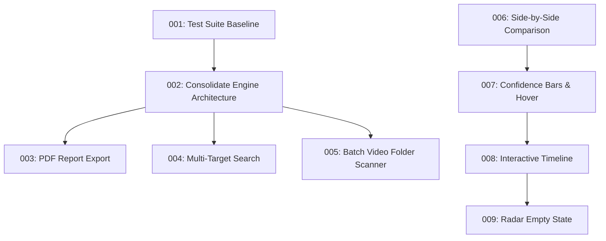

# Face Seeker - Codebase Improvement & Feature Roadmap Plans

This directory contains self-contained implementation plans generated by the `improve` advisor.

## Repository Commit Baseline
Written against state: `face-seeker-v1.4`

---

## 📋 Audit Findings & Leverage Ranking

| # | Finding / Plan | Category | Impact | Effort | Risk | Evidence | Status |
|---|---|---|---|---|---|---|---|
| 001 | [Automated Test Suite Baseline](001-test-suite-baseline.md) | Test Coverage | High (No automated tests; prevents regressions) | S (2-3 hrs) | LOW | No test files present in repo root | TODO |
| 002 | [Consolidate Face Engine Architecture](002-consolidate-face-engine-architecture.md) | Tech Debt / Architecture | High (Eliminates duplicated engine logic between `ui.py` and `face_engine.py`) | M (4-5 hrs) | LOW | `ui.py:835-994` vs `face_engine.py:376-512` | TODO |
| 003 | [Court-Ready PDF Incident Report Export](003-pdf-report-export.md) | Direction / Feature | High (Replaces raw CSV with formatted evidence PDF for law enforcement) | M (4-6 hrs) | LOW | `ui.py:1148-1179` | TODO |
| 004 | [Multi-Target Suspect Search](004-multi-target-search.md) | Direction / Feature | High (Enables searching multiple suspects in a single video scan) | M (5-7 hrs) | MED | `ui.py:348-398` | TODO |
| 005 | [Batch Video Folder Queue Scanner](005-batch-video-folder-scanner.md) | Direction / Feature | High (Enables overnight batch scanning of whole video directories) | M (5-6 hrs) | LOW | `ui.py:400-435` | TODO |
| 006 | [Side-by-Side Target Comparison Modal](006-side-by-side-target-comparison-modal.md) | Visual UI / UX | High (Side-by-side target vs detected face crop visual comparison) | S (2-3 hrs) | LOW | `ui.py:174-250` | TODO |
| 007 | [Match Card Confidence Bars & Win11 Hover](007-match-card-confidence-bars-and-hover-effects.md) | Visual UI / UX | High (Color-coded confidence progress bars & Win11 card hover highlights) | S (2 hrs) | LOW | `ui.py:1020-1080` | TODO |
| 008 | [Interactive Match Timeline Seekbar](008-interactive-match-timeline-seekbar.md) | Visual UI / UX | High (Interactive video timeline with timestamp match markers) | M (3-4 hrs) | LOW | `ui.py:530-580` | TODO |
| 009 | [Animated Radar Scanning Empty State](009-animated-scanning-radar-empty-state.md) | Visual UI / UX | Medium (Pulsating radar reticle graphic in empty match gallery) | S (1-2 hrs) | LOW | `ui.py:610-635` | TODO |

---

## 🔗 Dependency Graph

---

## 🚀 Recommended Execution Order

1. **`006-side-by-side-target-comparison-modal.md`**: Implement side-by-side face comparison in Match Detail Modal.
2. **`007-match-card-confidence-bars-and-hover-effects.md`**: Add color confidence bars & Win11 hover highlights to match cards.
3. **`008-interactive-match-timeline-seekbar.md`**: Add interactive video seekbar with match tick markers.
4. **`009-animated-scanning-radar-empty-state.md`**: Add radar scanning animation graphic for empty gallery state.
